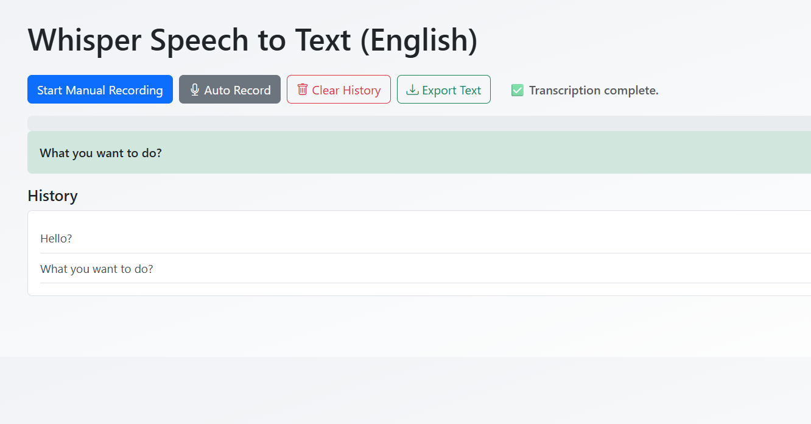

# Whisper Speech-to-Text Web App

A simple web application that uses OpenAI's Whisper model for speech-to-text transcription.  
Supports manual and automatic audio recording with silence detection, transcription history, and export functionality.  

Built with **Flask** and styled with **Bootstrap** for a clean and responsive UI.

---

## Features

- Manual audio recording with start/stop button  
- Automatic recording with silence detection (stops after 3 seconds of silence)  
- Live silence timer and progress bar during auto recording  
- Displays latest transcription highlighted on top  
- Scrollable history of previous transcriptions  
- Clear transcription history button  
- Export transcription history as a plain text file  
- Responsive UI using Bootstrap  
- Audio recording and transcription entirely handled in the browser and backend  

---

## Demo

_(Add a screenshot or demo link here if available)_

---

## Requirements

- Python 3.7+  
- `flask`  
- `numpy`  
- `pydub`  
- `openai-whisper` (or `whisper` package from OpenAI)  
- `ffmpeg` installed and available in system PATH (required for audio processing)  

---

## Installation

1. Clone the repository:

git clone https://github.com/poorna-c/whisper-speech-to-text-webapp.git
cd whisper-speech-to-text-webapp

2. Create and activate a virtual environment (recommended):
python -m venv venv
### Windows
venv\Scripts\activate
### macOS/Linux
source venv/bin/activate

3. Install Python dependencies:
pip install -r requirements.txt

4. Ensure ffmpeg is installed and accessible:

Windows: Download from https://ffmpeg.org/download.html and add to PATH

macOS (via Homebrew): brew install ffmpeg

Linux (apt): sudo apt-get install ffmpeg

## How to Use
Click Manual Record to start and stop recording audio manually.

Click Auto Record to start recording that will automatically stop after 3 seconds of silence.

The latest transcription appears highlighted at the top.

Scroll through previous transcriptions in the history box.

Use Clear History to remove all past transcriptions.

Use Export Text to download all transcription history as a .txt file.

## Notes
The app requires a working microphone on your device and browser permissions to record audio.

The Whisper model used is loaded locally to avoid repeated downloads (you need to have the model files ready).

Large or long recordings might take some time to transcribe depending on your hardware.

This app currently supports transcription in the languages Whisper can recognize (mostly English and popular languages).